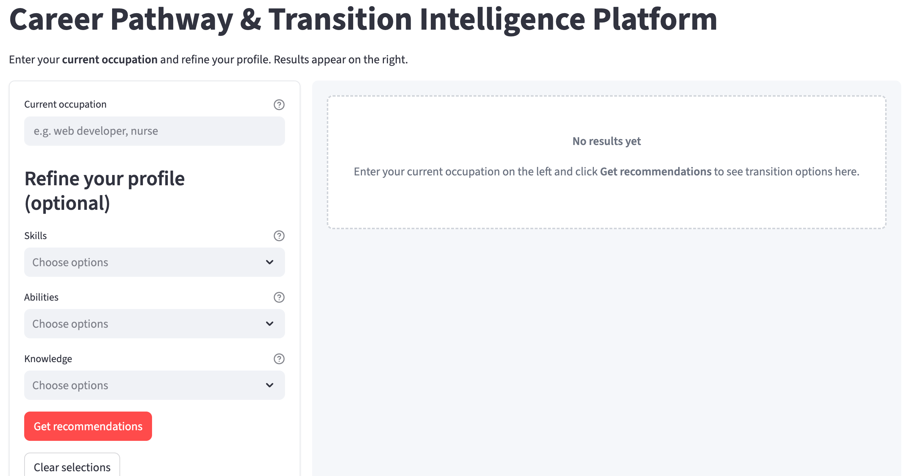
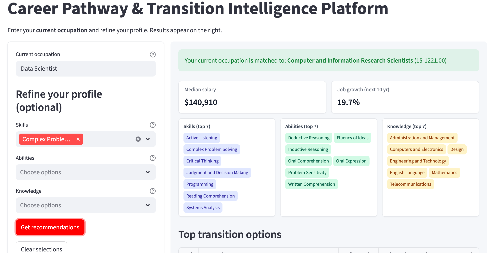
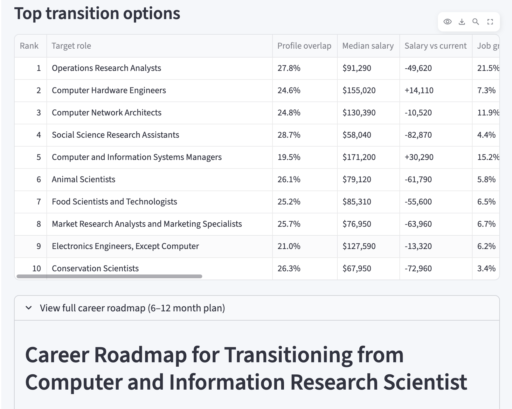
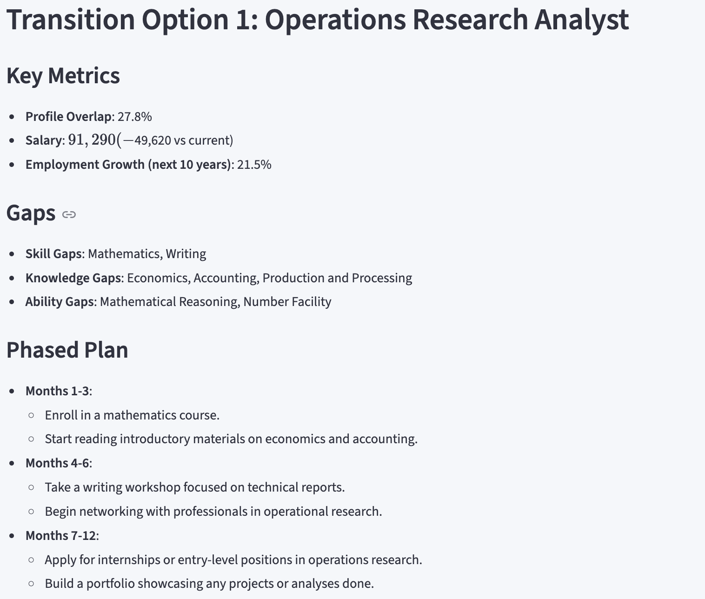
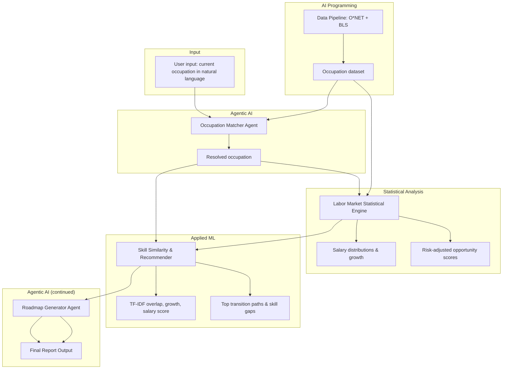

# AI Career Pathway & Labor Market Intelligence Platform

This repository is an **AI Career Pathway and Labor Market Intelligence Platform** using O*NET and BLS data.

---

## Contents


| Item                           | Description                                                  |
| ------------------------------ | ------------------------------------------------------------ |
| **Integrated artifact**        | Streamlit app (core interface) + data-refresh CLI + supporting code and docs |
| **Data**                       | O*NET (titles, skills, abilities, knowledge, work activities, interests, job zone) + BLS (wages, growth); merged to `data/occupations.csv` (see docs) |
| **Reflective Synthesis Paper** | See `Reflective_Synthesis_Paper.pdf`                         |
| **Supporting documentation**   | `docs/` (integration plan, system design, evaluation)        |
| **requirements.txt**           | Python dependencies for reproducibility                      |


---

## Quick start

1. **Create and activate a virtual environment:**
  ```bash
   python3 -m venv .venv
   source .venv/bin/activate   # Windows: .venv\Scripts\activate
  ```
2. **Install dependencies:**
  ```bash
   pip install -r requirements.txt
  ```
3. **BLS data (manual):** Download the two BLS files and save as in the table in the **Data pipeline** section below (Offline file sources). Links: [BLS OES Tables](https://www.bls.gov/oes/tables.htm) (May 2024 National), [occupation.xlsx](https://www.bls.gov/emp/ind-occ-matrix/occupation.xlsx) → `data/bls_oes/` and `data/bls_projections/`.
4. **Fetch/refresh data:**
  ```bash
   python -m src.run_data_pipeline refresh-data
  ```
   This downloads O*NET (extracts to data/onet/, then deletes the zip; extracted data/onet/ is kept and is in .gitignore), merges with BLS data from data folders, and writes occupation data to `data/`.
5. **Use the platform (Streamlit app):**
  ```bash
   streamlit run app.py
  ```
   Enter your current occupation in natural language, optionally refine with skills/abilities/knowledge, and get ranked transitions plus a 6–12 month career roadmap. Results and loading spinners appear in the right panel; the roadmap section is expanded by default and shows a progress message while generating (~30 s). If occupation data is missing, the app will prompt you to run `refresh-data` first (or the data loader can run the pipeline once automatically).
6. **Multi-agent system:** Add a `.env` file with `OPENAI_API_KEY` (and `OPENAI_BASE_URL` if using a custom endpoint). Two ADK agents: (1) **Occupation matcher agent**—natural language (e.g. `"web developer"`) is resolved by an ADK agent with a tool that provides the occupation list; it picks the closest match. (2) **Roadmap generator agent**—an ADK agent with a tool that provides current role and top-transition context; the agent writes the markdown career roadmap.

---

## Platform screenshots

**Landing page** — Enter your current occupation in natural language and optionally skills, abilities, or knowledge.



**Results (first page)** — Details about the current occupation



**Results (second page)** — Ranked career transitions with similarity scores, growth, salary, and skill gaps.



**Results (third page)** — 6–12 month narrative career roadmap generated by the roadmap agent.



---

## CLI (data refresh only)


| Command                                    | Description                                                                                                                                                      |
| ------------------------------------------ | ---------------------------------------------------------------------------------------------------------------------------------------------------------------- |
| `python -m src.run_data_pipeline refresh-data [--max N]` | Rebuild occupation data from O*NET and BLS. Use `--max N` to limit to N occupations. All other interaction (recommendations, roadmaps) is via the Streamlit app. |


---

## Component interaction

- **Input:** Current occupation in **natural language only** (e.g. "web developer", "nurse"), resolved by the **occupation-matching agent** (multi-agent system).
- **Statistical engine:** Labor market metrics from real BLS/O*NET data.
- **Skill similarity:** TF-IDF + cosine similarity on title, skills, abilities, knowledge, work activities, and interests; produces similarity scores and feeds the recommender.
- **Recommender:** Ranks transitions by similarity score, growth, and salary; lists skill gaps.
- **Multi-agent system:** (1) **Occupation matcher agent** – ADK agent with a tool that provides the occupation list; it chooses the best-matching occupation from the user’s free text. (2) **Roadmap generator agent** – ADK agent with a tool that returns current role and top-transition context; the agent produces the markdown roadmap.



See `docs/02_System_Design_and_Architecture.md` and the **Data pipeline** section below.

---

## Data

- **O*NET:** Occupation titles and Content Model skills (O*NET 28.2); pipeline downloads the ZIP, unzips to `data/onet/`, merges; the zip is deleted but extracted `data/onet/` is kept (in `.gitignore`) for inspection.
- **BLS:** Loaded from local data only (no API or download requests). Place OES May 2024 table XLSX in `data/bls_oes/` and `occupation.xlsx` in `data/bls_projections/` (sources: [OES tables](https://www.bls.gov/oes/tables.htm), [occupation.xlsx](https://www.bls.gov/emp/ind-occ-matrix/occupation.xlsx)).
- **Output:** Occupation data in `data/` with `id` (SOC), `title`, `skills`, `median_salary`, `growth_pct`, `sector`. The app loads it (or runs the data pipeline once on first use).

---

## Data pipeline

The platform uses O*NET (downloaded) and BLS data from **local data folders** (no BLS API or download requests).

### Offline file sources (manual download)

Documentation for the manually downloaded files so that sources and locations are not lost.

| File purpose | Official source | How to get it | Save as |
|--------------|-----------------|---------------|---------|
| **BLS OES wages** (national, May 2024) | U.S. BLS, Occupational Employment and Wage Statistics | [BLS OES Tables](https://www.bls.gov/oes/tables.htm) → May 2024 **National** (or "National XLS"). File is often named `national_M2024_dl.xlsx`. | Any `.xlsx` in **`data/bls_oes/`** |
| **BLS employment projections** (2024–2034) | BLS Employment Projections, occupation matrix | Direct: [occupation.xlsx](https://www.bls.gov/emp/ind-occ-matrix/occupation.xlsx) | **`data/bls_projections/occupation.xlsx`** |

**O*NET** is not manual: the pipeline downloads the text database ZIP from [O*NET Resource Center](https://onetcenter.org/database.html) (e.g. `db_28_2_text.zip`), extracts to `data/onet/`, deletes the zip; the extracted folder is kept and is in `.gitignore`.

### How to run

1. Download the BLS files from the links in **Offline file sources** above and place them in `data/bls_oes/` and `data/bls_projections/`.
2. From the project root:

```bash
pip install -r requirements.txt
python -m src.run_data_pipeline refresh-data
```

- **O*NET** is downloaded, unzipped to `data/onet/`, and the zip is deleted. The extracted `data/onet/` is kept (in `.gitignore`) so you can inspect it. **BLS** data is read from `data/bls_oes/` and `data/bls_projections/`; no API or requests to BLS.
- If occupation data is missing, the loader can run the data pipeline once (lazy init) when you use `list`, `search`, or `roadmap`.

Use the **Streamlit app** (`streamlit run app.py`) for recommendations and roadmaps. The CLI is for data refresh only.

### Module layout

| Module | Role |
|--------|------|
| `src/data_pipeline/soc.py` | Shared SOC normalization (XX-XXXX.00) for matching O*NET and BLS. |
| `src/data_pipeline/process_onet.py` | Download O*NET ZIP (if missing), extract to `data/onet/`; read Occupation Data, Skills, Abilities, Knowledge, Work Activities, Interests, Job Zones; extracted folder is kept (in `.gitignore`). |
| `src/data_pipeline/process_bls_oes.py` | Process OES wages from offline `data/bls_oes/*.xlsx`. |
| `src/data_pipeline/process_bls_projections.py` | Process employment growth from offline `data/bls_projections/occupation.xlsx` (Table 1.2). |
| `src/data_pipeline/merge.py` | Merge by SOC; output: id, title, skills, median_salary, growth_pct, sector, plus O*NET abilities, knowledge, work_activities, interests, job_zone when available. |
| `src/run_data_pipeline.py` | Orchestrate O*NET + BLS load; write occupation data to `data/`; CLI: `refresh-data`. |
| `src/data_loader.py` | Load occupation data from `data/`; run pipeline once if missing. |

---

## Project structure

```
├── app.py                     # Streamlit app (core): occupation + profile → recommendations + roadmap
├── src/
│   ├── run_data_pipeline.py   # Orchestrate pipeline + CLI: refresh-data
│   ├── data_loader.py         # Load occupation data; run data pipeline if missing
│   ├── data_pipeline/         # Data ingestion and merge (O*NET + BLS)
│   │   ├── soc.py, process_onet.py, process_bls_oes.py, process_bls_projections.py, merge.py
│   ├── statistical_engine.py
│   ├── recommender.py
│   ├── occupation_matcher.py  # Occupation-matching agent (natural language → occupation)
│   └── roadmap_generator.py
├── data/                      # BLS files (manual) + occupation data (generated)
├── docs/
└── requirements.txt
```

---

## License and use

This project is submitted as academic work. Use and adaptation should follow your program’s academic integrity and citation policies.