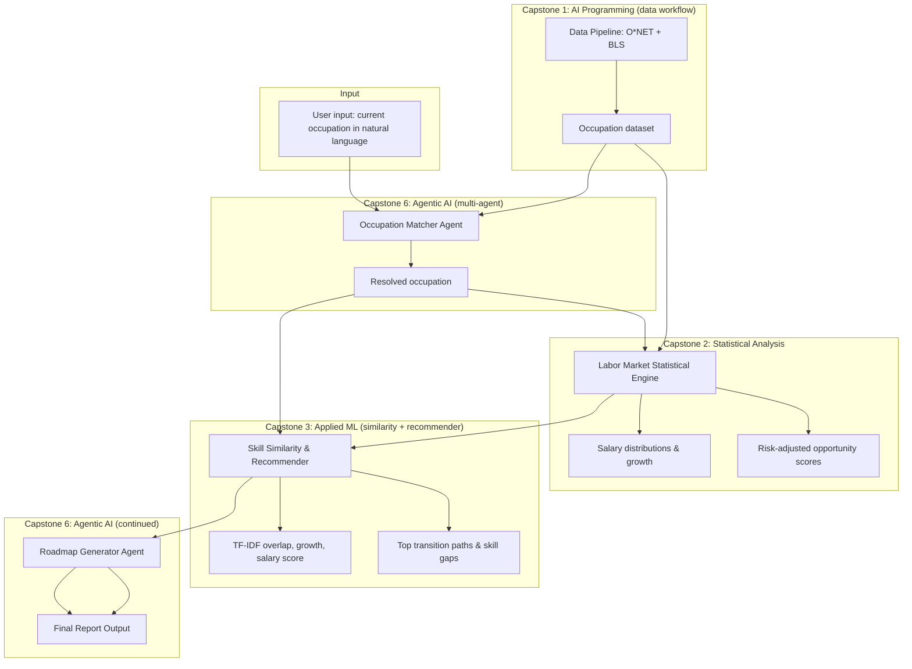

# Task 3: Design of the Integrated AI System

## System Overview
The platform is a **decision-support system** for career pathway and labor market intelligence. It does not replace human judgment; it synthesizes labor market data, transition predictions, skill-based recommendations, and agentic orchestration into a single pipeline that produces a personalized career roadmap and summary report.

## Architecture Description

### Data Flow
1. **Data Pipeline:** Reproducible data workflow—O*NET fetch, BLS merge, write to `data/`. Run via `python -m src.run_data_pipeline refresh-data` or on first load when data is missing. See the project README (Data pipeline section).
2. **Input:** User profile (current occupation, education, experience, optional target sector).
3. **Labor Market Statistical Engine:** Loads occupation-level data (e.g., BLS), computes salary distributions, growth rates, and risk-adjusted scores; outputs structured metrics per occupation.
4. **Skill Similarity & Recommender:** Uses TF-IDF and cosine similarity over occupation text (title, skills, abilities, knowledge, work activities, interests) to compute profile overlap. Combines overlap (80%), growth (10%), and salary (10%) into a single score to rank top transitions and list skill, knowledge, and ability gaps. 
5. **Multi-Agent Module:** Two ADK agents. (1) **Occupation matcher agent**—resolves natural-language occupation via a tool that provides the occupation list. (2) **Roadmap generator agent**—uses a tool to get current role and top-transition context, then produces the structured markdown roadmap (6–12 months), risk warnings, and salary expectations. 

### Model Flow
- Statistics → growth scores and salary metrics for the recommender.
- Recommender → ranked paths (by overlap + growth + salary score) and skill/knowledge/ability gaps.
- Occupation matcher agent → selected occupation; app runs recommender; roadmap generator agent → final markdown report.

### Assumptions
- Occupation and skill data are available (e.g., BLS, O*NET).
- Transition “success” can be approximated by heuristics.
- Users understand that outputs are decision support, not guarantees.
- One pipeline run is sufficient for a single user profile; real-time streaming is out of scope.

### Design Tradeoffs
- **Simplicity vs. realism:** Use a manageable set of occupations and heuristics transition labels to keep the artifact runnable; real deployment would use richer data and labels.
- **Interpretability vs. performance:** Prefer interpretable models (e.g., TF-IDF, cosine similarity) where possible; document tradeoffs if moving to more complex models.
- **Static data vs. dynamic market:** Design accepts static snapshots; extensions could add periodic data refresh.

### Boundaries of System Capability and Responsibility
- **In scope:** Integrated analysis and recommendation for demonstration; clear documentation of data sources and limitations.
- **Out of scope:** Real-time job posting ingestion, legal or financial advice, guarantees of employment or salary outcomes. The system does not make decisions for the user; it supports them.

## Architecture Diagram

Below is a system-level architecture diagram suitable for inclusion in the paper or submission. You may also render the Mermaid diagram in a tool that supports it (e.g., GitHub, many Markdown viewers).

### 
